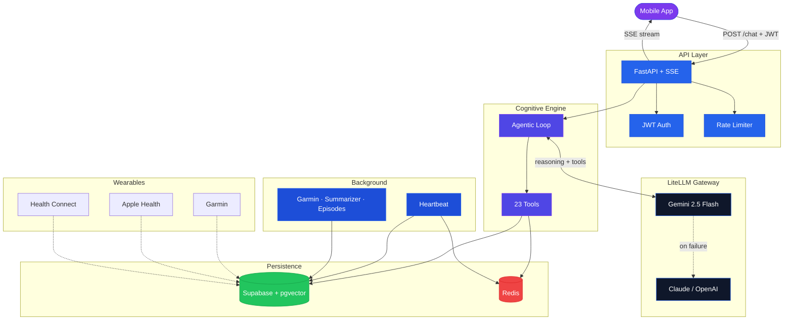
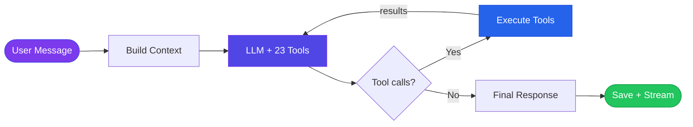
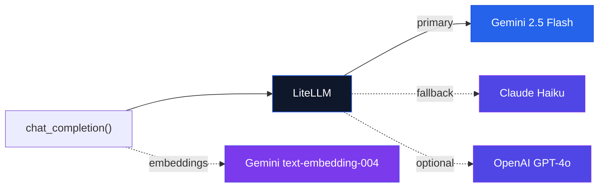
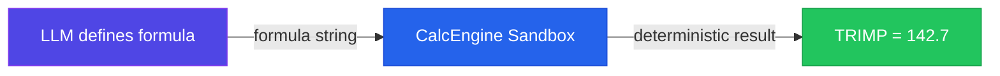
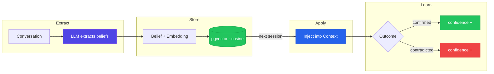
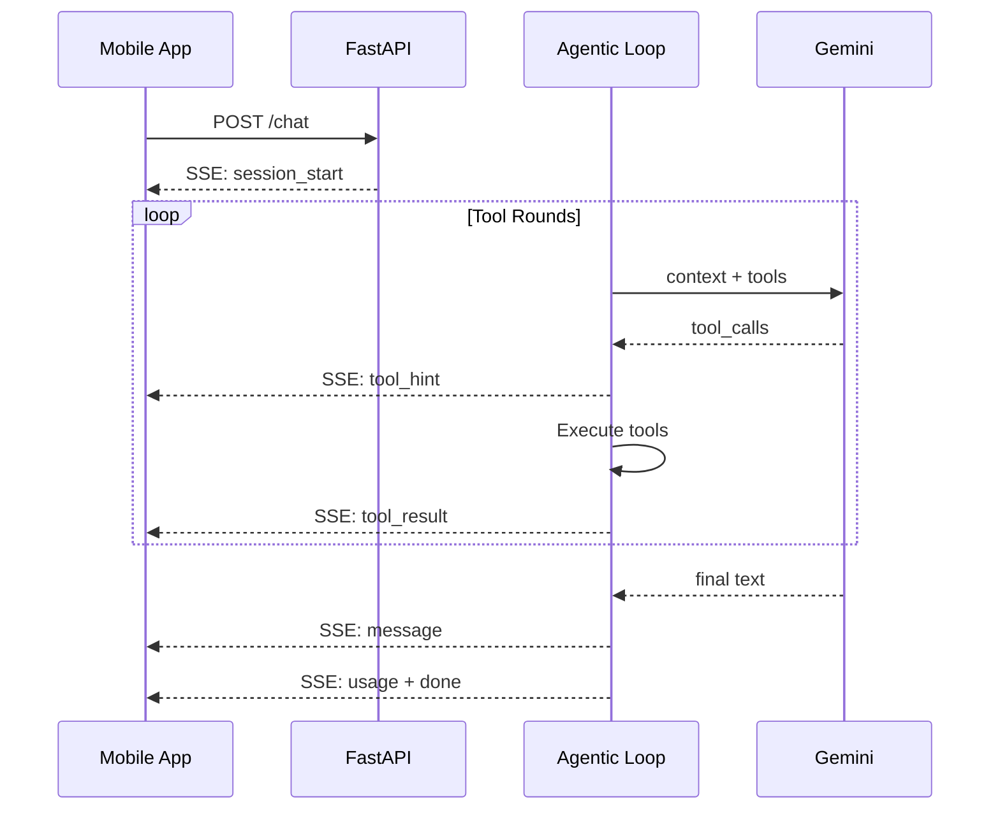
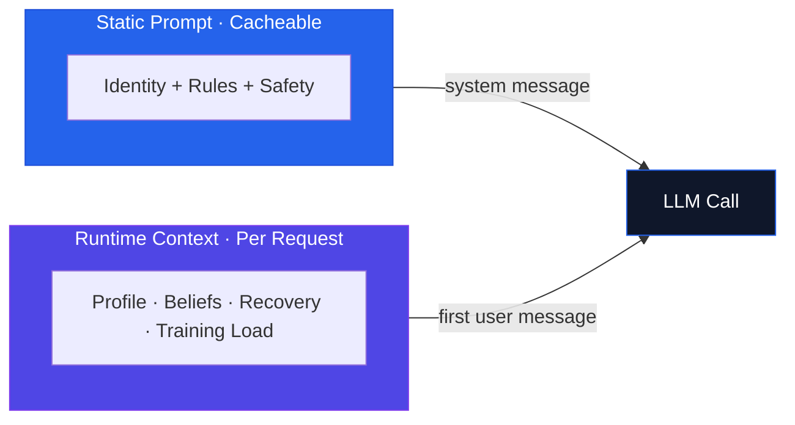
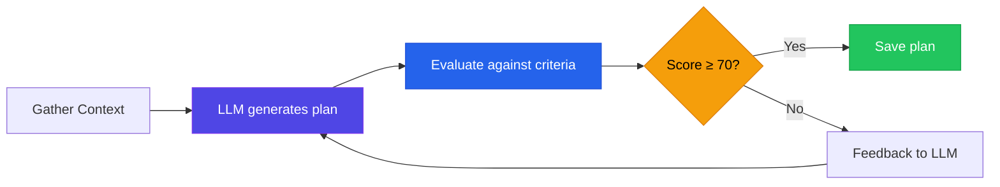

<div align="center">
  <h1>Athletly Backend</h1>
  <h3>Autonomous AI Sports Coach — Depth over Breadth</h3>
  <p>
    
    
    
    
    
    
    
  </p>
</div>

---

An autonomous coaching engine powered by a **Claude Code-inspired agentic loop** with 23 specialized tools. The LLM reasons, the code computes — all sport knowledge is learned at runtime, never hardcoded. Built on **LiteLLM** for provider-agnostic model access, **Supabase** with pgvector for belief-driven memory, and **Redis** for distributed concurrency control. Streams every tool call in real time via **Server-Sent Events**.

---

## Table of Contents

- [System Architecture](#system-architecture)
- [Agentic Loop](#agentic-loop)
- [LiteLLM — Provider-Agnostic LLM Gateway](#litellm--provider-agnostic-llm-gateway)
- [Code Computes, LLM Reasons](#code-computes-llm-reasons)
- [Belief-Driven Memory](#belief-driven-memory)
- [Real-Time SSE Streaming](#real-time-sse-streaming)
- [Prompt Architecture](#prompt-architecture)
- [Tool System](#tool-system)
- [Plan Generation & Evaluation](#plan-generation--evaluation)
- [Proactive Intelligence](#proactive-intelligence)
- [Background Services](#background-services)
- [Tech Stack](#tech-stack)
- [Project Structure](#project-structure)
- [Design Decisions](#design-decisions)
- [License](#license)

---

## System Architecture

A high-level view of how requests flow from the mobile app through the cognitive engine to persistence and background services.



---

## Agentic Loop

The core of the system is a **Claude Code-inspired autonomous loop**. The LLM receives all 23 tools and decides what to call, when, and in what order — there is no hardcoded orchestration or routing logic.



**How it works:**
1. The user's message is enriched with runtime context (profile, recent training, recovery, beliefs)
2. The LLM sees the full tool registry and decides autonomously which tools to call
3. Tool results are appended to the conversation and the LLM reasons again
4. This loops until the LLM decides to respond with text — the coaching answer
5. The session, messages, and any new beliefs are persisted

**Constraints:** max 25 tool rounds per message, context compression at 40 messages, 2KB tool output cap, daily token budget per user.

---

## LiteLLM — Provider-Agnostic LLM Gateway

All LLM calls go through **LiteLLM**, a unified interface that makes switching providers a one-line config change. The backend is not locked into any single AI provider.



| Model | Role | Temperature |
|---|---|---|
| Gemini 2.5 Flash | Primary — coaching, planning, analysis | 0.7 (creative) |
| Gemini 2.0 Flash | Voice parsing — fast structured extraction | 0.1 (deterministic) |
| Claude Haiku 4.5 | Automatic fallback when Gemini is unavailable | inherited |
| text-embedding-004 | 768-dim belief embeddings for pgvector similarity search | — |

**Key features:** automatic fallback chain across providers, `drop_params=True` for cross-provider compatibility, Gemini 2.5 thinking budget injection (10K tokens) when tools + large prompts are combined.

---

## Code Computes, LLM Reasons

The agent defines metrics and formulas at runtime via tools. A sandboxed expression engine (**CalcEngine** via `evalidate`) evaluates them deterministically — no hallucinated math, no hardcoded sport logic.



| Concern | Who Handles It |
|---|---|
| Which metrics matter for this sport? | LLM — `define_metric()` |
| Calculate TRIMP from heart rate data | CalcEngine — sandboxed formula evaluation |
| Is this training plan good enough? | LLM — scores against agent-defined criteria |
| What's my threshold pace? | CalcEngine — Jack Daniels formula, agent-defined |
| Should I reduce intensity this week? | LLM — analyzes recovery + load + beliefs |

The LLM can define any sport-specific metric (TRIMP, TSS, pace zones, HR zones, power curves) as a formula string. CalcEngine evaluates it in a whitelist-only sandbox — no imports, no I/O, just math.

---

## Belief-Driven Memory

Every piece of athlete knowledge is stored as a **belief** with confidence scores, vector embeddings, and outcome tracking. Beliefs strengthen on confirmation and decay on contradiction.



Each belief carries: **confidence** (0.0–1.0), **category** (preference, constraint, fitness, physical, motivation, ...), **stability** (stable / evolving / transient), **768-dim embedding** (Gemini text-embedding-004), and **outcome history** (confirmed / contradicted events).

The system uses **hybrid retrieval** — BM25 keyword search + pgvector cosine similarity — to find relevant beliefs for the current conversation context. Beliefs with confidence below 0.3 are automatically archived.

---

## Real-Time SSE Streaming

The chat endpoint streams every stage of the agent's reasoning to the client via Server-Sent Events — tool calls, intermediate results, and thinking are all visible in real time.



**Event types:** `session_start` → `thinking` → `tool_hint` → `tool_result` → `message` → `usage` → `done`

Concurrency is handled via Redis distributed locks (one active session per user). If Redis is unavailable, an in-process lock provides graceful fallback.

---

## Prompt Architecture

The system prompt is split into a **static** component (identical for all users, LLM-cacheable) and a **runtime context** (per-user, per-request). This split enables provider-side prompt caching for significant cost and latency reduction.



**Static prompt** (~1,600 lines): defines the coaching identity, tool usage patterns, belief extraction mandate, and language detection rules. Never changes between requests.

**Runtime context** (per request): current date, athlete profile (name, sports, goals, fitness metrics), active beliefs (confidence ≥ 0.6), 7-day training summary (sessions, TRIMP, volume), recovery status (sleep, HRV, stress, body battery), and macrocycle week context.

---

## Tool System

23 tools organized into domain-specific categories. The LLM receives the complete registry every turn and autonomously selects what to call.

| Category | Tools | Purpose |
|---|---|---|
| **Data** | `get_athlete_profile`, `get_activities`, `get_current_plan`, `get_beliefs` | Read athlete state |
| **Analysis** | `analyze_training_load`, `compare_plan_vs_actual`, `classify_activity` | Training insights |
| **Planning** | `create_training_plan`, `evaluate_plan`, `save_plan`, `create_macrocycle` | Plan lifecycle |
| **Health** | `get_daily_metrics`, `analyze_health_trends`, `get_health_inventory` | Wearable integration |
| **Memory** | `add_belief`, `update_profile`, `get_episodes` | Belief management |
| **Config** | `define_metric`, `define_eval_criteria`, `define_session_schema`, `define_periodization` | Runtime definitions |
| **Goals** | `assess_goal_trajectory` | Finish time projection |
| **Checkpoints** | `propose_plan_change`, `get_pending_confirmations` | Async user confirmation |
| **Research** | `web_search` | External knowledge (Brave API) |
| **Calculation** | `calculate_metric`, `calculate_bulk_metrics` | Dynamic formula evaluation |

Tools are registered as OpenAI-compatible function schemas, making them work across all LiteLLM-supported providers.

---

## Plan Generation & Evaluation

Training plans go through a **generate → evaluate → regenerate** cycle until quality meets the agent-defined threshold.



Evaluation criteria are **agent-defined at runtime** via `define_eval_criteria` — the system has no hardcoded understanding of what makes a good plan. Criteria are weighted and scored per dimension: volume appropriateness, intensity distribution, recovery integration, goal alignment, progressive overload, and constraint compliance. Below 70/100 the plan is regenerated with evaluation feedback — up to 3 iterations.

---

## Proactive Intelligence

The **HeartbeatService** runs every 30 minutes, scanning active users for conditions that warrant outreach — without the athlete asking.


Trigger rules are **agent-defined** as CalcEngine formulas (e.g., `avg_hrv_7d < 35 AND total_sessions_7d >= 6` → high fatigue warning). Built-in checks cover silence detection (no interaction for 5+ days), unknown activities from health providers, and goal timeline risk. The heartbeat also drives periodic **episode consolidation** (weekly reflections → monthly synthesis → belief promotion) and **self-improvement checks** on agent-defined metric definitions.

---

## Background Services

| Service | Trigger | Purpose |
|---|---|---|
| **HeartbeatService** | Every 30 min | Proactive triggers, episode consolidation, self-improvement |
| **GarminSyncService** | On demand (15-min cooldown) | Garmin Connect OAuth, activity + metrics sync |
| **SessionSummarizer** | On new session start | LLM-compress previous session for context efficiency |
| **EpisodeConsolidation** | Via heartbeat (~24h) | Synthesize weekly reflections → monthly reviews → promote patterns to beliefs |
| **UsageTracker** | Per LLM call | Token accounting and daily budget enforcement (fail-open) |
| **ConfigGC** | On new session start | Garbage collection for stale agent-defined configs |

All non-critical services follow a **fail-open** philosophy — tracking failures are logged but never block the chat. Critical operations (auth, rate limiting) are fail-closed.

---

## Tech Stack

| Layer | Technology | Role |
|---|---|---|
| **Runtime** | Python 3.12+, uv | Language + fast package management |
| **API** | FastAPI + Uvicorn | Async ASGI server |
| **Streaming** | SSE (sse-starlette) | Real-time event streaming to client |
| **LLM Gateway** | LiteLLM | Provider-agnostic LLM calls (Gemini, Claude, OpenAI) |
| **Primary Model** | Gemini 2.5 Flash | Coaching agent, plan generation, analysis |
| **Embeddings** | Gemini text-embedding-004 | 768-dim belief vectors for similarity search |
| **Database** | Supabase (PostgreSQL + pgvector + RLS) | Persistence, vector search, row-level security |
| **Concurrency** | Redis 7 | Distributed locks, cooldowns, confirmation store |
| **Auth** | Supabase JWT (ES256 / HS256) | User authentication |
| **Rate Limiting** | slowapi + Redis | Per-IP and per-user throttling |
| **Wearables** | garminconnect (Garth) | Garmin Connect OAuth + data sync |
| **Formula Engine** | evalidate (CalcEngine) | Sandboxed math expression evaluation |
| **Search** | BM25 (bm25s) + pgvector cosine | Hybrid belief retrieval |
| **CI/CD** | GitHub Actions → Docker → Hetzner | Automated SSH-based deployment |

---

## Project Structure

```
src/
├── api/                          # API Gateway
│   ├── main.py                  #   App factory, CORS, rate limiting, lifespan
│   ├── auth.py                  #   Supabase JWT (ES256 + HS256)
│   ├── rate_limiter.py          #   slowapi + Redis / in-memory fallback
│   ├── sse.py                   #   SSE event helpers
│   └── routers/
│       ├── chat.py              #   POST /chat (SSE), POST /chat/confirm
│       ├── onboarding.py        #   POST /parse-voice, POST /setup
│       ├── webhook.py           #   POST /webhook/activity (HMAC-SHA256)
│       └── garmin.py            #   Garmin Connect OAuth + sync
│
├── agent/                        # Cognitive Engine
│   ├── agent_loop.py            #   Core agentic loop (Claude Code pattern)
│   ├── llm.py                   #   LiteLLM wrapper + fallback chain
│   ├── system_prompt.py         #   Static prompt + runtime context builder
│   ├── coach.py                 #   Plan generation with coach system prompt
│   ├── plan_evaluator.py        #   Plan scoring against agent-defined criteria
│   ├── assessment.py            #   Training assessment (plan vs actual)
│   ├── reflection.py            #   Episodic reflections + meta-belief extraction
│   ├── proactive.py             #   Trigger detection engine
│   └── tools/                   #   23 tool modules
│       ├── registry.py          #     Registration + OpenAI schema generation
│       ├── data_tools.py        #     Profile, activities, plans, beliefs
│       ├── analysis_tools.py    #     Training load, plan adherence
│       ├── planning_tools.py    #     Plan creation, evaluation, macrocycle
│       ├── memory_tools.py      #     Belief management, profile updates
│       ├── config_tools.py      #     Runtime metric / criteria definitions
│       ├── health_tools.py      #     Daily metrics, health inventory, trends
│       ├── checkpoint_tools.py  #     Async user confirmation flow
│       └── ...                  #     research, garmin, product, notification
│
├── db/                           # Data Access Layer (19 modules)
│   ├── client.py                #   Supabase singleton (sync + async)
│   ├── user_model_db.py         #   Profiles + beliefs (pgvector)
│   ├── session_store_db.py      #   Sessions + message history
│   ├── activity_store_db.py     #   Activities + FIT import deduplication
│   ├── plans_db.py              #   Training plans + evaluation scores
│   ├── health_data_db.py        #   Garmin / Apple Health / Health Connect
│   ├── agent_config_db.py       #   Runtime-defined metrics, criteria, schemas
│   └── ...                      #   episodes, proactive_queue, provider_tokens
│
├── services/                     # Background Workers
│   ├── heartbeat.py             #   30-min proactive trigger loop
│   ├── garmin_sync.py           #   Garmin Connect OAuth + data sync
│   ├── session_summarizer.py    #   LLM session compression
│   ├── episode_consolidation.py #   Weekly → monthly → belief promotion
│   ├── usage_tracker.py         #   Token budget enforcement
│   └── health_context.py        #   Recovery context builder
│
├── calc/
│   └── engine.py                #   evalidate expression sandbox
│
├── memory/                       # User Model Abstractions
│   └── user_model.py            #   Structured core + belief interface
│
└── config.py                     # Pydantic Settings v2
```

---

## Design Decisions

| Decision | Rationale |
|---|---|
| **Code computes, LLM reasons** | Agent defines formulas via tools, CalcEngine evaluates them safely. Zero hardcoded sport logic. |
| **Single agent, not a swarm** | One coach who knows you deeply beats five generic assistants. |
| **23 tools, no router** | The LLM autonomously selects tools each turn. No orchestration code. |
| **LiteLLM over direct SDK** | Provider-agnostic. Switch Gemini → Claude by changing one env var. |
| **Static + runtime prompt split** | Static prompt is LLM-cacheable. Runtime context is injected fresh. |
| **Belief-driven memory** | Confidence decays on contradiction, strengthens on confirmation. Not just key-value storage. |
| **SSE over WebSockets** | Simpler protocol, unidirectional streaming, better proxy compatibility. |
| **Fail-open for non-critical** | Usage tracking, summarization, consolidation — never block the chat. |
| **Redis with in-process fallback** | Distributed locks when available, graceful degradation when not. |

---

## License

MIT — see [LICENSE](LICENSE).
