<div align="center">
  <h1>Athletly Backend</h1>
  <h3>Autonomous AI Sports Coach — Depth over Breadth</h3>
  <p>
    
    
    
    
    
    
    
  </p>
</div>

---

An autonomous coaching engine that reasons through an agentic loop with 23 specialized tools, belief-driven memory with pgvector embeddings, and real-time SSE streaming. Built on FastAPI with Supabase multi-user persistence, Redis concurrency control, and LiteLLM as the provider-agnostic LLM gateway.

> **Why "Depth over Breadth"?** Most agent frameworks go wide: many platforms, many providers, generic tools. Athletly goes **deep**: one domain, 23 specialized tools, belief-driven memory, probabilistic athlete modeling. The LLM makes every coaching decision — but the math is always correct.

---

## System Architecture

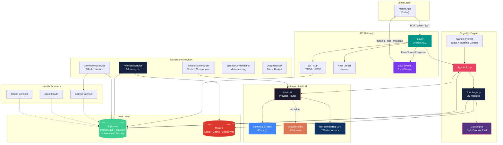

---

## Core Principle: Code Computes, LLM Reasons

The agent defines metrics, formulas, and evaluation criteria at runtime through tools. A sandboxed expression engine (`CalcEngine` via `evalidate`) evaluates them deterministically — no hardcoded sport logic, no LLM-hallucinated math.

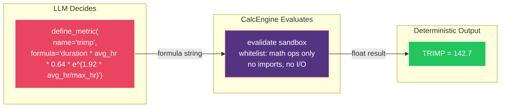

**What this means in practice:**

| Concern | Who Handles It | How |
|---|---|---|
| Which metrics matter for this sport? | LLM | `define_metric()`, `define_eval_criteria()` |
| Calculate TRIMP from heart rate data | CalcEngine | Sandboxed formula evaluation |
| Is this plan good enough? | LLM | Scores against agent-defined criteria |
| What's my threshold pace? | CalcEngine | Jack Daniels formula, agent-defined |
| Should I adjust intensity this week? | LLM | Analyzes recovery + load + beliefs |

---

## Agentic Loop

Inspired by [Claude Code](https://docs.anthropic.com/en/docs/claude-code) — the LLM sees all 23 tools and autonomously decides what to call, when, and in what order.

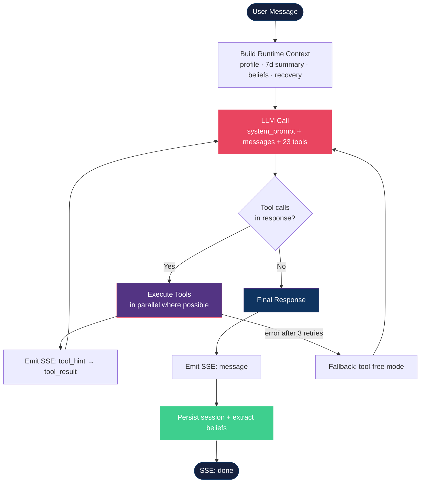

**Loop constraints:**
- Max **25 tool rounds** per message (prevents infinite loops)
- **Context compression** at 40 messages (older turns summarized, last 4 kept verbatim)
- **Tool output truncation** at 2KB per tool call
- **Daily token budget** per user (500K tokens default, tracked via `UsageTracker`)

---

## LLM Layer: LiteLLM Provider Abstraction

LiteLLM provides a unified OpenAI-compatible interface across all providers. One `chat_completion()` call works with Gemini, Claude, or OpenAI — switching models requires only a config change.

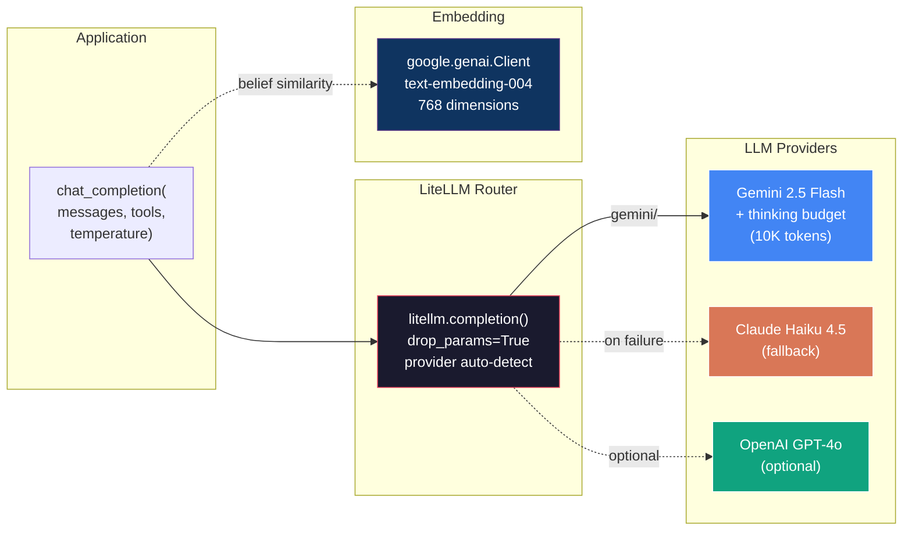

**Model selection strategy:**

| Model | Use Case | Temperature |
|---|---|---|
| Gemini 2.5 Flash | Main agent loop, plan generation, coaching | 0.7 |
| Gemini 2.0 Flash | Voice parsing (onboarding, fast extraction) | 0.1 |
| Claude Haiku 4.5 | Automatic fallback when Gemini fails | inherited |
| text-embedding-004 | Belief similarity search (pgvector cosine) | — |

**Gemini 2.5 special handling:** When tools + large system prompts are combined, a `thinking` budget of 10,000 tokens is injected to prevent empty responses — a Gemini-specific optimization handled transparently by the LLM layer.

---

## Belief-Driven Memory System

Every piece of athlete knowledge is a **belief** — not a static field. Beliefs carry confidence scores, pgvector embeddings, outcome tracking, and temporal metadata. They strengthen on confirmation and decay on contradiction.

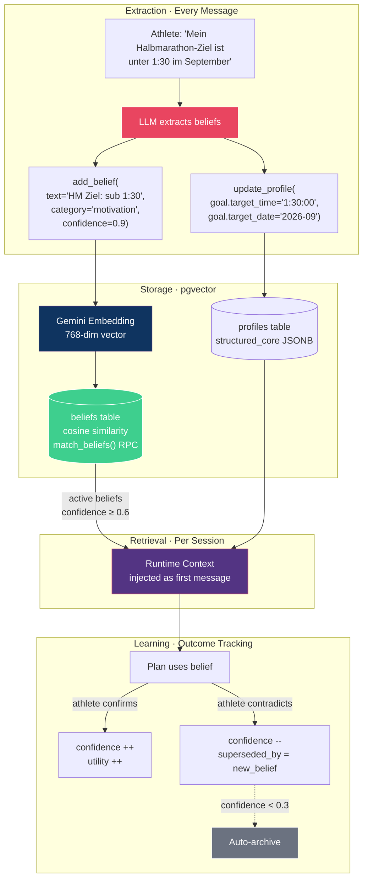

**Belief schema:**

| Field | Type | Purpose |
|---|---|---|
| `text` | string | Human-readable belief content |
| `category` | enum | `preference` · `constraint` · `fitness` · `physical` · `motivation` · `history` · `scheduling` · `personality` · `meta` |
| `confidence` | float 0.0–1.0 | Strength of belief, updated on confirm/contradict |
| `embedding` | vector(768) | Gemini `text-embedding-004` for similarity search |
| `stability` | enum | `stable` · `evolving` · `transient` |
| `durability` | enum | `global` · `seasonal` · `episode` · `session` |
| `outcome_history` | jsonb[] | Tracks confirm/contradict events over time |

---

## Real-Time SSE Streaming

The chat endpoint streams every stage of the agent's reasoning to the client — not just the final answer. Tool calls, intermediate results, and thinking are all visible in real time.

```mermaid
sequenceDiagram
    participant App as Mobile App
    participant API as FastAPI
    participant Lock as Redis Lock
    participant Agent as Agent Loop
    participant LLM as Gemini 2.5 Flash
    participant Tools as Tool Registry
    participant DB as Supabase

    App->>+API: POST /chat {message, session_id, JWT}
    API->>Lock: SET agent_loop:lock:{user_id} NX EX 300
    API->>DB: UserModelDB.load_or_create(user_id)
    API->>+Agent: AsyncAgentLoop.process_message_sse()
    API-->>App: SSE: session_start {session_id}

    rect rgb(30, 30, 50)
        Note over Agent,Tools: Tool Round 1
        Agent->>+LLM: system_prompt + context + messages + tools
        LLM-->>-Agent: tool_calls: [get_activities, get_daily_metrics]
        Agent-->>App: SSE: tool_hint {name, args}
        Agent->>+Tools: execute(get_activities, {days: 7})
        Tools->>DB: SELECT FROM activities...
        Tools-->>-Agent: {sessions: 5, distance_km: 42}
        Agent-->>App: SSE: tool_result {name, preview}
    end

    rect rgb(30, 30, 50)
        Note over Agent,Tools: Tool Round 2
        Agent->>+LLM: messages + tool_results
        LLM-->>-Agent: tool_calls: [create_training_plan]
        Agent-->>App: SSE: tool_hint {name, args}
        Agent->>+Tools: execute(create_training_plan, {...})
        Tools->>LLM: generate_plan(coach_prompt, context)
        Tools-->>-Agent: {plan: {...}, evaluation_score: 82}
        Agent-->>App: SSE: tool_result {name, preview}
    end

    Agent->>+LLM: messages + tool_results
    LLM-->>-Agent: "Hier ist dein Trainingsplan..."
    Agent-->>App: SSE: message {text}
    Agent->>DB: save session + messages + beliefs
    Agent-->>App: SSE: usage {tokens}
    Agent-->>-App: SSE: done

    API->>Lock: DEL agent_loop:lock:{user_id}
    deactivate API
```

**SSE event types:**

| Event | When | Payload |
|---|---|---|
| `session_start` | Immediately | `{session_id}` |
| `thinking` | LLM reasoning | `{text}` |
| `tool_hint` | Before tool execution | `{name, args}` |
| `tool_result` | After tool execution | `{name, preview}` |
| `tool_error` | Tool failure | `{name, error}` |
| `message` | Final response | `{text}` |
| `pending_action` | Checkpoint proposal | `{action_id, type, description}` |
| `usage` | Token accounting | `{input_tokens, output_tokens}` |
| `done` | Stream complete | `{}` |

---

## Prompt Architecture: Static + Runtime Split

The system prompt is split into a **static** component (identical for all users, LLM-cacheable) and a **runtime context** (per-user, per-request).

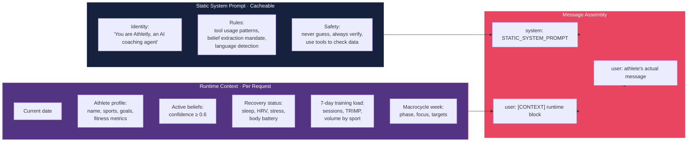

**Why split?** The static prompt (~1,600 lines) is identical across all requests. LLM providers can cache it, reducing latency and cost. The runtime context changes per user and session — injected fresh every turn.

---

## Tool System

23 tools organized into domain-specific categories. The LLM autonomously selects which tools to call — there is no router, no hardcoded orchestration.

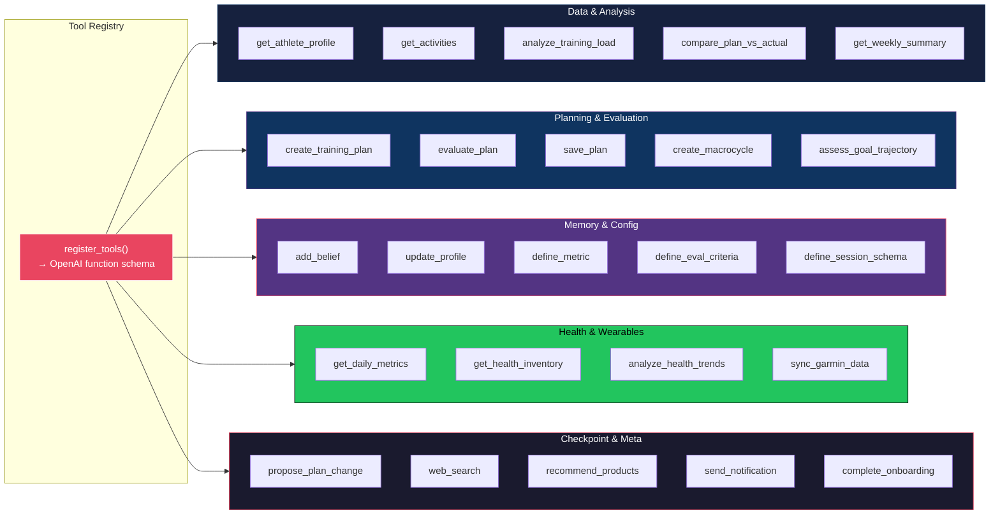

**How tools integrate with the LLM:**
- Tools are registered as OpenAI-compatible function schemas
- LLM receives the full tool list every turn and decides which to call
- Tool execution results are appended as `tool_result` messages
- Multi-tool calls within a single LLM response are executed in parallel where possible

---

## Plan Generation & Evaluation Loop

Training plans go through a generate-evaluate-regenerate cycle until quality meets the threshold.

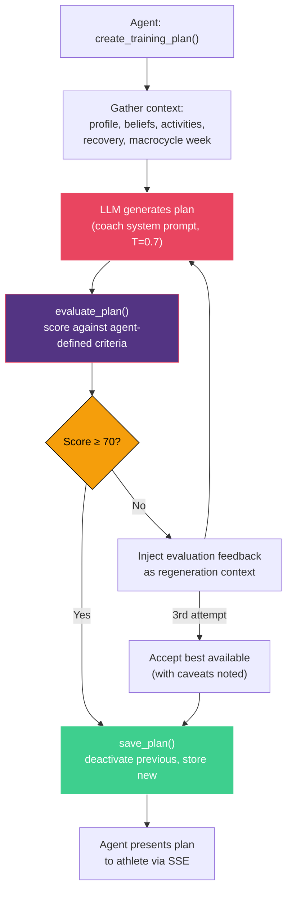

**Evaluation dimensions** (agent-defined at runtime via `define_eval_criteria`):
- Volume appropriateness for fitness level
- Intensity distribution (80/20 rule compliance)
- Recovery integration (rest days, easy sessions)
- Goal alignment (specificity for target event)
- Progressive overload (week-over-week progression)
- Constraint compliance (available days, max duration)

---

## Proactive Intelligence

The `HeartbeatService` runs every 30 minutes, scanning active users for conditions that warrant proactive outreach — without the athlete asking.

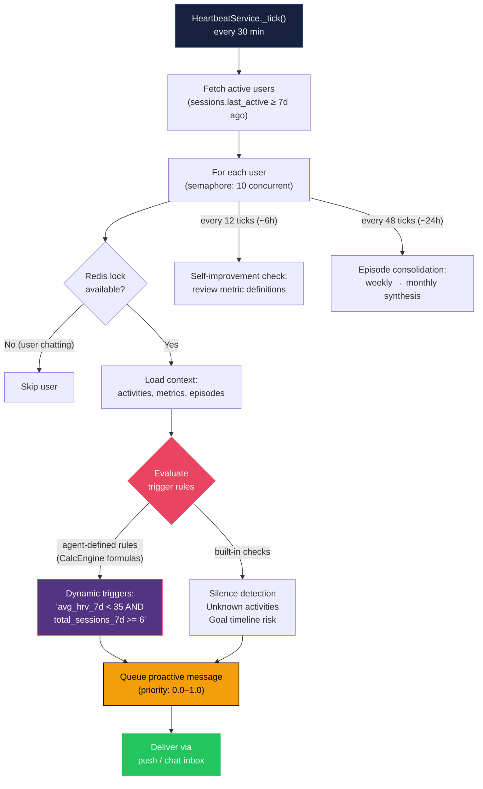

**Trigger examples:**

| Trigger | Condition | Priority |
|---|---|---|
| High fatigue warning | `avg_hrv_7d < 35 AND total_sessions_7d >= 6` | HIGH |
| Goal at risk | Projected finish time > target by >5% | HIGH |
| Missed session pattern | 3+ consecutive planned sessions skipped | MEDIUM |
| Fitness improving | New personal best detected | LOW |
| Silence | No interaction for 5+ days | MEDIUM |

---

## Onboarding Pipeline

Voice-first onboarding: the client captures speech, sends the transcript, and the backend extracts structured data — then bootstraps the entire coaching system.

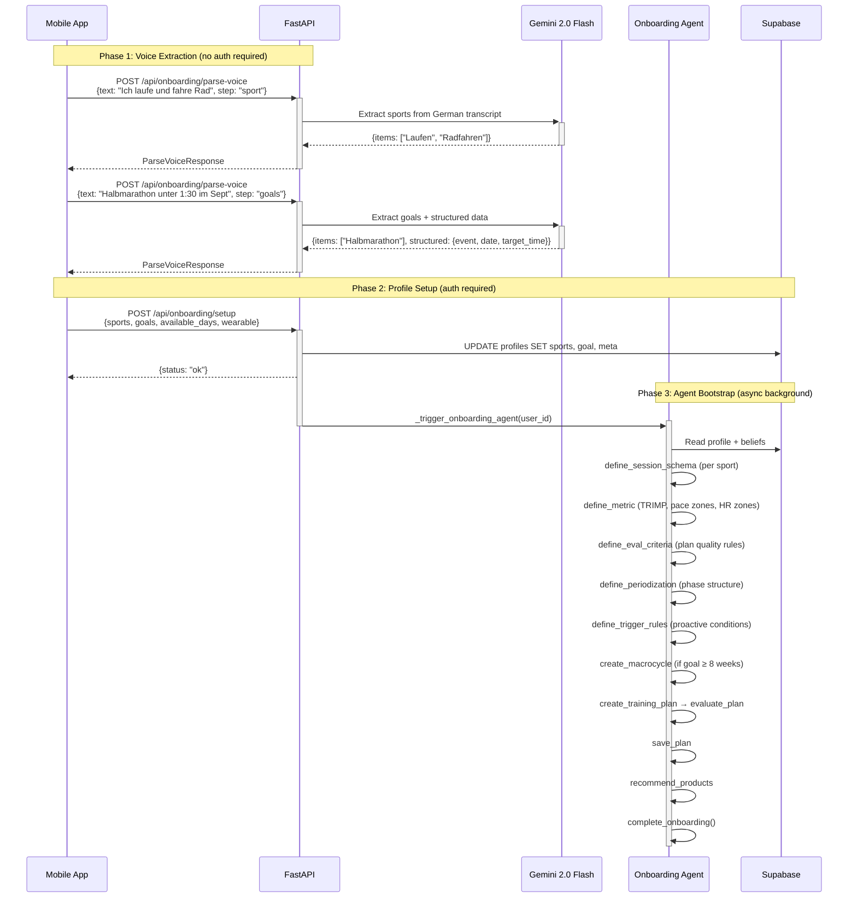

---

## Data Architecture

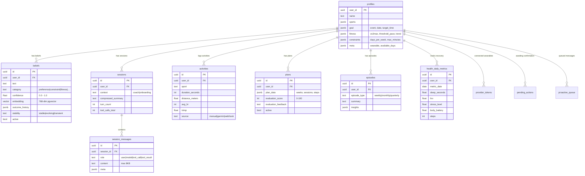

**Key data patterns:**
- **Row-Level Security (RLS)** on every table — each user only sees their own data
- **pgvector** for belief similarity search via `match_beliefs()` PostgreSQL RPC
- **Immutable writes** — updates return new objects, never mutate in place
- **Import deduplication** via SHA-256 file hashing in `import_manifest`
- **Partial unique indexes** prevent duplicate pending actions and proactive messages

---

## Concurrency & Resilience

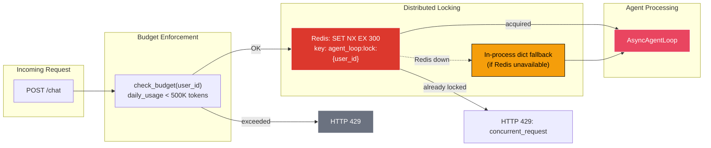

**Resilience philosophy: fail-open for non-critical, fail-closed for critical.**

| Component | On Failure | Strategy |
|---|---|---|
| Redis | In-process dict lock | Graceful degradation |
| LLM (Gemini) | Try Claude Haiku fallback | `chat_completion_with_fallback()` |
| Usage tracking | Log at DEBUG, continue | Fail-open |
| Session summarizer | Skip summary, continue | Fail-open |
| JWT verification | HTTP 401 | Fail-closed |
| HMAC webhook signature | HTTP 401 | Fail-closed |

---

## Security Architecture

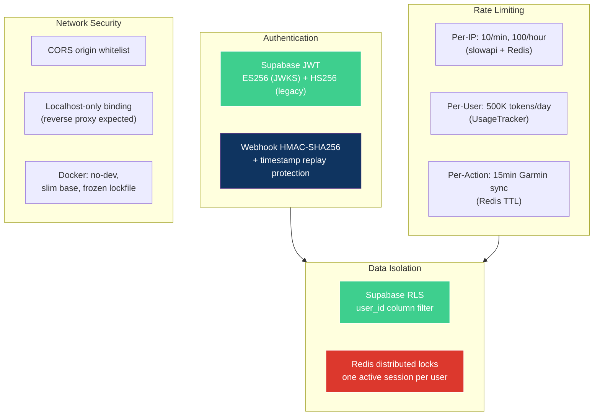

---

## Background Services

| Service | Interval | Purpose | Failure Mode |
|---|---|---|---|
| **HeartbeatService** | 30 min | Proactive trigger detection, episode consolidation, self-improvement | Log + continue |
| **GarminSyncService** | On demand | Garmin Connect OAuth, activity + metrics sync | HTTP error to client |
| **SessionSummarizer** | Per new session | LLM-compress previous session for context efficiency | Skip silently |
| **EpisodeConsolidation** | ~24h (via heartbeat) | Synthesize weekly reflections → monthly reviews → promote patterns to beliefs | Log + skip month |
| **UsageTracker** | Per LLM call | Token accounting, model-specific pricing, budget enforcement | Fail-open |
| **ConfigGC** | Per new session | Remove stale agent-defined configs | Log + skip |

---

## Deployment

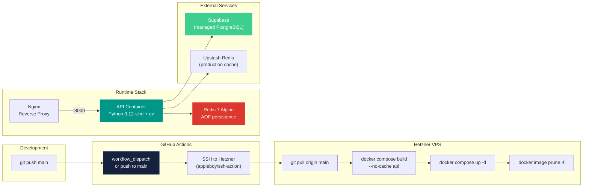

---

## Tech Stack

| Layer | Technology | Role |
|---|---|---|
| **Runtime** | Python 3.12+, uv | Language + package management |
| **API** | FastAPI + Uvicorn | ASGI server, async-native |
| **Streaming** | SSE (sse-starlette) | Real-time event streaming |
| **LLM Gateway** | LiteLLM | Provider-agnostic LLM calls (Gemini, Claude, OpenAI) |
| **Primary Model** | Gemini 2.5 Flash | Coaching agent, plan generation |
| **Embeddings** | Gemini text-embedding-004 | 768-dim belief similarity search |
| **Database** | Supabase (PostgreSQL + pgvector) | Persistence, RLS, vector search |
| **Concurrency** | Redis 7 | Distributed locks, cooldowns, confirmations |
| **Auth** | Supabase JWT (ES256/HS256) | User authentication |
| **Rate Limiting** | slowapi + Redis | Per-IP and per-user throttling |
| **Wearables** | garminconnect (Garth) | Garmin Connect OAuth + data sync |
| **Formula Engine** | evalidate (CalcEngine) | Sandboxed math expression evaluation |
| **Search** | BM25 (bm25s) + pgvector cosine | Hybrid belief retrieval |
| **Containerization** | Docker + docker-compose | Reproducible deployment |
| **CI/CD** | GitHub Actions | SSH-based deploy to Hetzner |

---

## Project Structure

```
src/
├── api/                          # API Gateway
│   ├── main.py                  #   App factory, CORS, rate limiting, lifespan
│   ├── auth.py                  #   Supabase JWT (ES256 + HS256)
│   ├── rate_limiter.py          #   slowapi + Redis/in-memory
│   ├── sse.py                   #   SSE event helpers
│   └── routers/
│       ├── chat.py              #   POST /chat (SSE), POST /chat/confirm
│       ├── onboarding.py        #   POST /parse-voice, POST /setup
│       ├── webhook.py           #   POST /webhook/activity (HMAC)
│       └── garmin.py            #   Garmin Connect OAuth + sync
│
├── agent/                        # Cognitive Engine
│   ├── agent_loop.py            #   Core agentic loop (Claude Code pattern)
│   ├── llm.py                   #   LiteLLM wrapper + fallback chain
│   ├── system_prompt.py         #   Static prompt + runtime context builder
│   ├── coach.py                 #   Plan generation (coach system prompt)
│   ├── plan_evaluator.py        #   Plan scoring (agent-defined criteria)
│   ├── assessment.py            #   Training assessment (plan vs actual)
│   ├── reflection.py            #   Episodic reflections + meta-belief extraction
│   ├── proactive.py             #   Trigger detection engine
│   ├── dynamic_triggers.py      #   CalcEngine-based trigger rules
│   └── tools/                   #   23 Tool Modules
│       ├── registry.py          #     Registration + OpenAI schema generation
│       ├── data_tools.py        #     Profile, activities, plans, beliefs
│       ├── analysis_tools.py    #     Training load, plan adherence
│       ├── planning_tools.py    #     Plan creation, evaluation, macrocycle
│       ├── memory_tools.py      #     Belief management, profile updates
│       ├── config_tools.py      #     Runtime metric/criteria definitions
│       ├── health_tools.py      #     Daily metrics, health inventory
│       ├── checkpoint_tools.py  #     Async user confirmation flow
│       └── ...                  #     research, garmin, product, notification
│
├── db/                           # Data Access Layer (19 modules)
│   ├── client.py                #   Supabase singleton (sync + async)
│   ├── user_model_db.py         #   Profiles + beliefs (pgvector)
│   ├── session_store_db.py      #   Sessions + message history
│   ├── activity_store_db.py     #   Activities + FIT import manifest
│   ├── plans_db.py              #   Training plans + evaluation scores
│   ├── health_data_db.py        #   Garmin/Apple Health/Health Connect
│   ├── agent_config_db.py       #   Runtime-defined configs
│   └── ...                      #   episodes, proactive_queue, provider_tokens
│
├── services/                     # Background Workers
│   ├── heartbeat.py             #   30-min proactive trigger loop
│   ├── garmin_sync.py           #   Garmin Connect OAuth + data sync
│   ├── session_summarizer.py    #   LLM session compression
│   ├── episode_consolidation.py #   Weekly → monthly synthesis
│   ├── usage_tracker.py         #   Token budget enforcement
│   └── health_context.py        #   Recovery context builder
│
├── calc/
│   └── engine.py                #   evalidate expression sandbox
│
├── memory/                       # User Model Abstractions
│   ├── user_model.py            #   Structured core + belief interface
│   └── episodes.py              #   Episode storage helpers
│
└── config.py                     # Pydantic Settings v2
```

---

## Design Decisions

| Decision | Rationale |
|---|---|
| **Code computes, LLM reasons** | Agent defines formulas via tools, CalcEngine evaluates them safely. No hardcoded sport logic, no hallucinated math. |
| **Single agent, not a swarm** | One coach who knows you well > five generic assistants. Specialist sub-agents spawn only for focused analysis. |
| **23 tools, no router** | LLM autonomously selects the right tools each turn. No hardcoded orchestration. |
| **Static + runtime prompt split** | Static prompt is LLM-cacheable (cost reduction). Runtime context injected fresh per request. |
| **Belief-driven memory** | Confidence decays on contradiction, strengthens on confirmation. Not just key-value storage. |
| **LiteLLM over direct SDK** | Provider-agnostic. Switch from Gemini to Claude by changing one env var. |
| **Supabase + RLS** | Multi-user isolation at database layer. Service role for backend ops. |
| **Redis with in-process fallback** | Distributed locks when available, graceful degradation when not. |
| **SSE over WebSockets** | Simpler protocol, unidirectional streaming, better proxy compatibility. |
| **Fail-open for non-critical** | Usage tracking, summarization, consolidation — never block the chat. |

---

## License

MIT — see [LICENSE](LICENSE).
